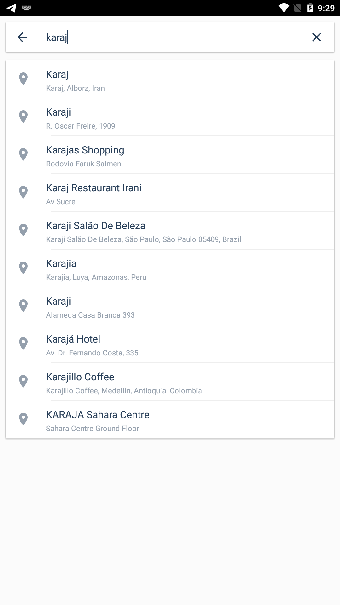
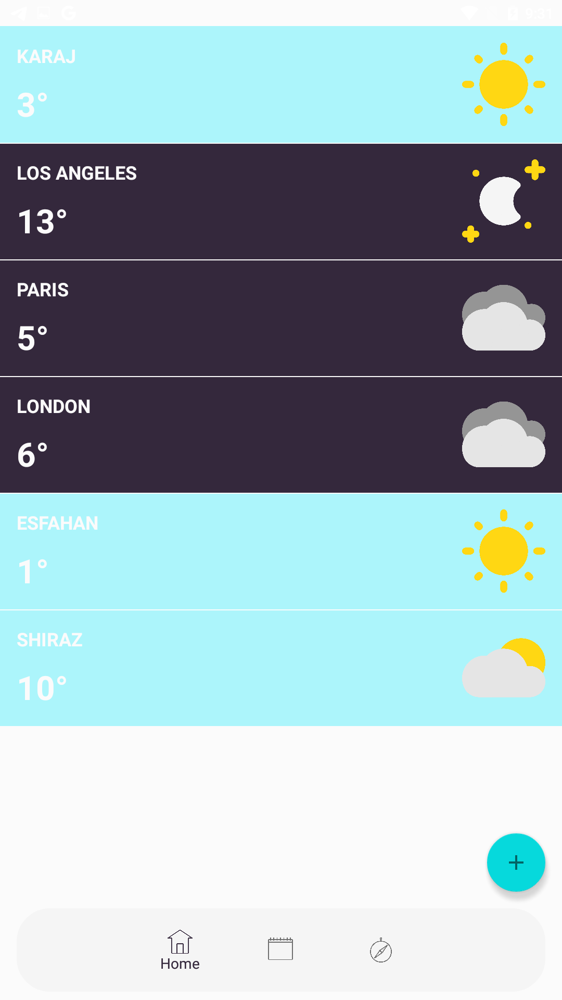
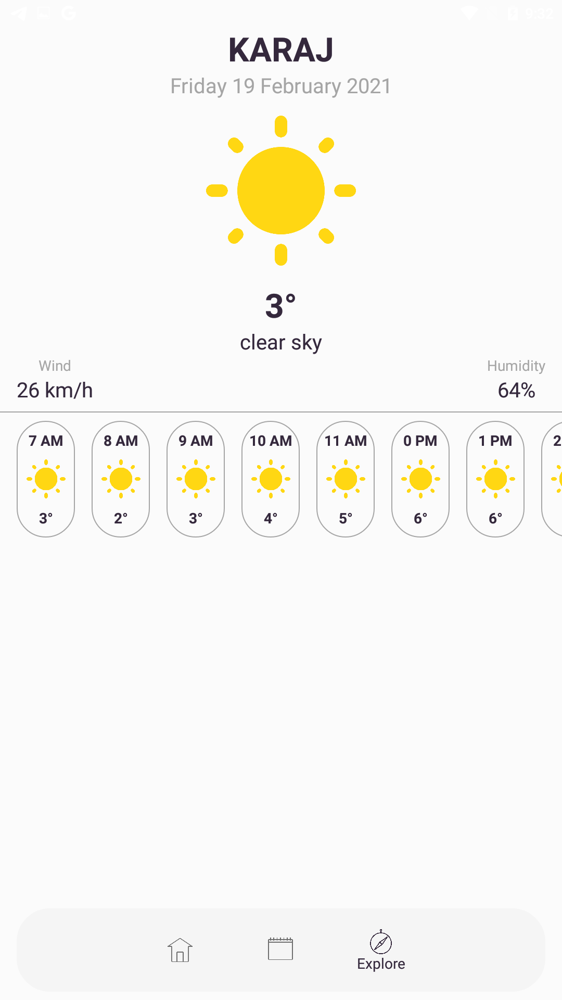
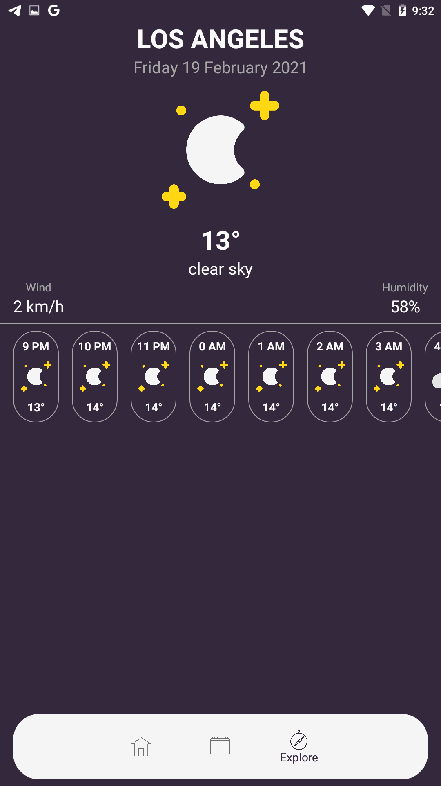
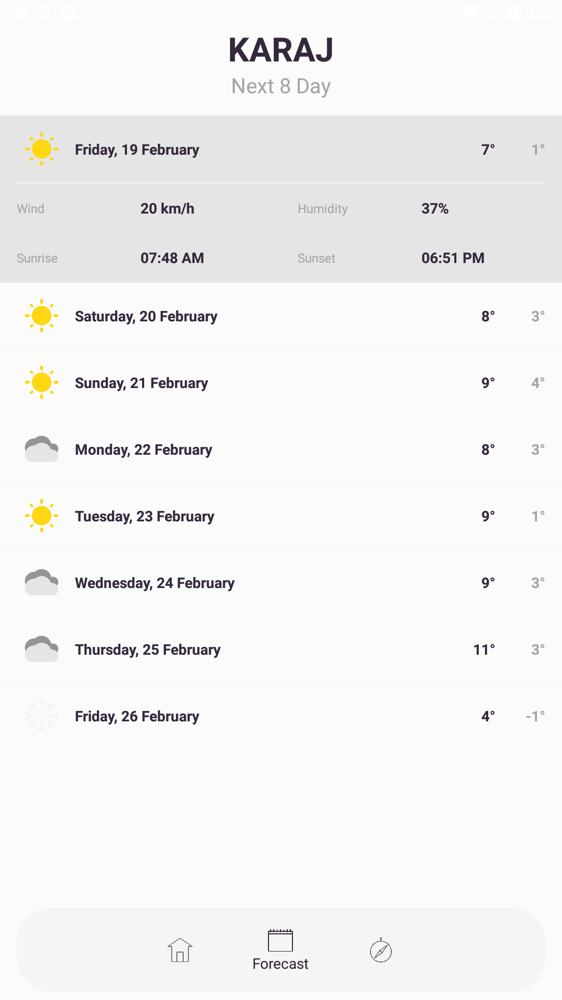

# Weather App

  
  
  

  
  

  
  See also [Weather App Video](https://www.youtube.com/watch?v=ZX9Vd_J90is)

# Requirements
- Android Studio 4.1.1
- Android SDK 29
- Supports API Level +16

# Features
 - Material Design
 - Add your favorites cities 
 - Android Cards
 - Refresh gestures pulling down from the top
 - Swipe to delete 
 - Simple and clean 

## Built With

* Kotlin - A modern statically typed programming language
* Retrofit - A type-safe HTTP client for Android and Java
* OpenWeatherMap - Weather API used 
* Gson - A Java serialization/deserialization library to convert Java Objects into JSON and back
* Glide - A powerful image downloading and caching library for Android
* Room - A powerful database for android
* MVVM - A powerful android design pattern
* RxJava - A programming paradigm oriented around data flows and the propagation of change i.e. it is all about responding to value changes
